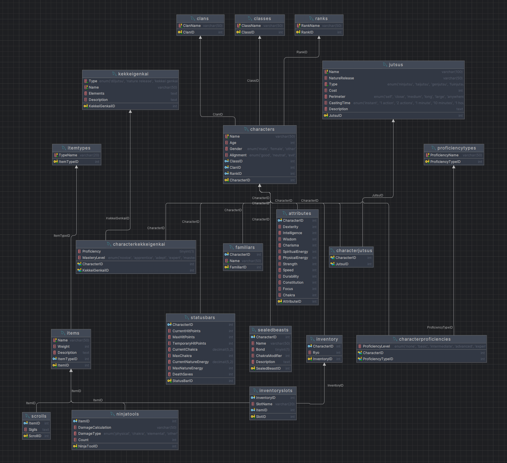

# Game Database Project

This project consists of a Database, that has the go al to functionaly store any character information for a **Dungeons & Dragons** style game, applicaple to the universe of the Naruto Anime and Manga.

The database has the following goals:
- Handle simple character information like name, age, and so on
- Store information of the skills of the characters that can be used for combat and other gameplay
- Store techniques the characters could use



## Important techniques

When handling the date, I made sure to speparate all of my querries into files, groupd by a common responcibility.

First, we had the entire database stored in the [mainSchema.sql](project/mainSchema.sql) file.
Here is what I deem important about it:

```sql
START TRANSACTION;

-- ...

COMMIT;
```

Firstly, I use the "Transaction" pattern, meaning that I put all of my statements under a single block. The commit doesn't happen until every single statement has been excecuted successfully. This I've used also in every single file that is designed to deal with a lot of querries at once.

Then I have 3 files I have assigned specifically to extracting data.
- [CharacterCharacteristics.sql](project/baseData/CharacterCharacteristics.sql) has all the information that is reused through characters
- [items.sql](project/baseData/items.sql) has all the information needed for items
- [jutsus.sql](project/baseData/jutsus.sql) includes all techniques that would potentially be used by different characters.

Now, onto character insertions:

Here, the most important thing to do was to use variables, as to not lose my mind by repeatedly typing a single number over, and over, and over again. 

```sql
SET @NarutoID = LAST_INSERT_ID();


INSERT INTO Attributes
(CharacterID, Dexterity, Intelligence, Wisdom, Charisma,
 SpiritualEnergy, PhysicalEnergy, Strength, Speed, Durability,
 Constitution, Focus, Chakra)
VALUES
    (
        @NarutoID,
        14,   
        12,   
        14,   
        18,   
        25,   
        25,   
        16,   
        18,   
        16,   
        17,   
        18,   
        30    
    );
```


