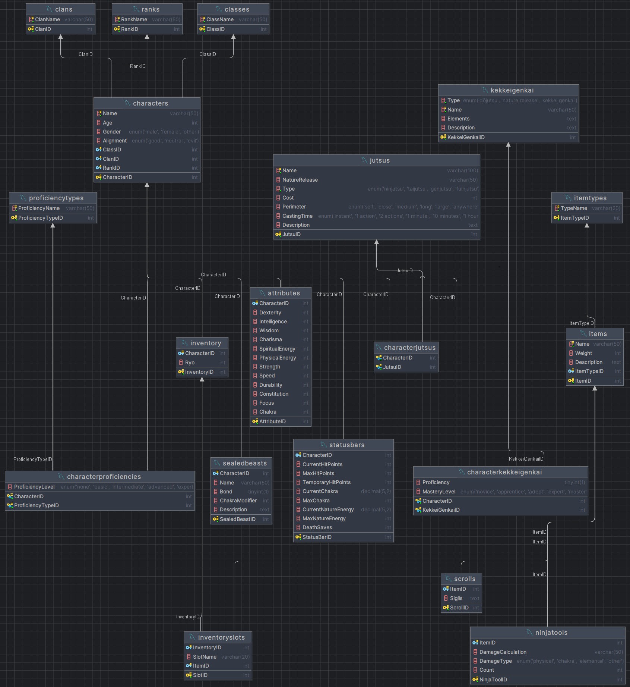

# Game Database Project

This project consists of a Database that has the goal to functionally store any character information for a **Dungeons & Dragons** style game, applicable to the universe of the Naruto Anime and Manga.

The database has the following goals:
- Handle simple character information like name, age, and so on
- Store information of the skills of the characters that can be used for combat and other gameplay
- Store techniques the characters could use



## Important Techniques

When handling the data, I made sure to separate all of my queries into files, grouped by a common responsibility.

First, we had the entire database stored in the [main_schema.sql](project/main_schema.sql) file. Here is what I deem important about it:

```sql
START TRANSACTION;

-- ...

COMMIT;
```

Firstly, I use the "Transaction" pattern, meaning that I put all of my statements under a single block. The commit doesn't happen until every single statement has been executed successfully. This I've used also in every single file that is designed to deal with a lot of queries at once.

Then I have 3 files I have assigned specifically to extracting data.
- [character_characteristics.sql](project/baseData/character_characteristics.sql) has all the information that is reused through characters
- [items.sql](project/baseData/items.sql) has all the information needed for items
- [jutsus.sql](project/baseData/jutsus.sql) includes all techniques that would potentially be used by different characters.

Now, onto character insertions:

Here, the most important thing to do was to use variables, as to not lose my mind by repeatedly typing a single number over, and over, and over again.

```sql
SET @NarutoID = LAST_INSERT_ID();

INSERT INTO Attributes
(CharacterID, Dexterity, Intelligence, Wisdom, Charisma,
 SpiritualEnergy, PhysicalEnergy, Strength, Speed, Durability,
 Constitution, Focus, Chakra)
VALUES
    (
        @NarutoID,
        14,   
        12,   
        14,   
        18,   
        25,   
        25,   
        16,   
        18,   
        16,   
        17,   
        18,   
        30    
    );
```

## Normalization

After inserting all the data into the database, it fits all 3 steps of normalization:

- **1NF**: All tables have atomic columns with unique records
- **2NF**: Non-key attributes are fully dependent on the primary key
- **3NF**: There are no transitive dependencies among non-key attributes

---

## User Guide

This guide provides instructions on how to interact with the **Game Database**, focusing on the primary user roles: **GameMaster** and **Player**. It covers inserting new characters, querying data, and maintaining data integrity.

### Table of Contents
1. [User Roles and Permissions](#user-roles-and-permissions)
    - [GameMaster](#gamemaster)
    - [Player](#player)
2. [Inserting Characters](#inserting-characters)
    - [Required Data](#required-data)
    - [Example Insertion](#example-insertion)
3. [Viewing Data](#viewing-data)
    - [GameMaster Queries](#gamemaster-queries)
    - [Player Queries](#player-queries)
4. [Updating and Deleting Data](#updating-and-deleting-data)
    - [GameMaster Operations](#gamemaster-operations)
5. [Using Views](#using-views)
6. [Formatting and Best Practices](#formatting-and-best-practices)
7. [Troubleshooting](#troubleshooting)

---

### User Roles and Permissions

The database employs **Role-Based Access Control (RBAC)** to ensure that users have access only to the data necessary for their role. The primary roles are **GameMaster** and **Player**.

#### GameMaster

**Description**: The GameMaster oversees the game, manages characters, items, and jutsus, and ensures the integrity of the game data.

**Permissions**:
- **SELECT**: View all data across all tables.
- **INSERT**: Add new records to any table.
- **UPDATE**: Modify existing records in any table.
- **DELETE**: Remove records from any table.

**Typical Responsibilities**:
- Creating and managing characters
- Assigning items and jutsus to characters
- Adjusting character attributes and statuses
- Overseeing game mechanics and balance

#### Player

**Description**: Players interact with their own characters, viewing and updating specific information related to their gameplay experience.

**Permissions**:
- **SELECT**: View their own character data.
- **UPDATE**: Modify certain aspects of their own character, such as status bars or inventory.
- **INSERT**: Limited to adding specific types of data, such as new jutsus or items acquired during gameplay.

**Typical Responsibilities**:
- Managing their character's inventory
- Selecting and using jutsus
- Tracking their character's status (hit points, chakra, etc.)
- Viewing their character's attributes and proficiencies

---

### Inserting Characters

As a **GameMaster**, you will frequently insert new characters into the database. This process involves adding records across multiple tables to ensure comprehensive data representation.

#### Required Data

When inserting a new character, ensure that you provide the following information:

1. **Characters Table**:
    - `Name`
    - `Age`
    - `Gender`
    - `Alignment`
    - `ClassID`
    - `ClanID`
    - `RankID`

2. **Attributes Table**:
    - `CharacterID` (auto-generated via variable)
    - `Dexterity`
    - `Intelligence`
    - `Wisdom`
    - `Charisma`
    - `SpiritualEnergy`
    - `PhysicalEnergy`
    - `Strength`
    - `Speed`
    - `Durability`
    - `Constitution`
    - `Focus`
    - `Chakra`

3. **CharacterProficiencies Table**:
    - `CharacterID`
    - `ProficiencyTypeID`
    - `ProficiencyLevel`

4. **CharacterKekkeiGenkai Table**:
    - `CharacterID`
    - `KekkeiGenkaiID`
    - `Proficiency`
    - `MasteryLevel`

5. **Inventory Table**:
    - `CharacterID`
    - `Ryo`

6. **InventorySlots Table**:
    - `InventoryID`
    - `SlotName`
    - `ItemID`

7. **SealedBeasts Table** (if applicable):
    - `CharacterID`
    - `Name`
    - `Bond`
    - `ChakraModifier`
    - `Description`

8. **CharacterJutsus Table**:
    - `CharacterID`
    - `JutsuID`

9. **StatusBars Table**:
    - `CharacterID`
    - `CurrentHitPoints`
    - `MaxHitPoints`
    - `TemporaryHitPoints`
    - `CurrentChakra`
    - `MaxChakra`
    - `CurrentNatureEnergy`
    - `MaxNatureEnergy`
    - `DeathSaves`

#### Example Insertion

Here's a step-by-step example of inserting a new character, **Kakashi Hatake**:

```sql
START TRANSACTION;

-- Insert into Characters
INSERT INTO Characters
(Name, Age, Gender, Alignment, ClassID, ClanID, RankID)
VALUES
    ('Kakashi Hatake', 34, 'Male', 'Good', 1, 8, 5);

-- Capture the last inserted CharacterID
SET @KakashiID = LAST_INSERT_ID();

-- Insert into Attributes
INSERT INTO Attributes
(CharacterID, Dexterity, Intelligence, Wisdom, Charisma,
 SpiritualEnergy, PhysicalEnergy, Strength, Speed, Durability,
 Constitution, Focus, Chakra)
VALUES
    (
        @KakashiID,
        18,   
        20,   
        19,   
        16,   
        25,   
        25,   
        17,   
        19,   
        18,   
        20,   
        22,   
        35    
    );

-- Insert into CharacterProficiencies
INSERT INTO CharacterProficiencies
(CharacterID, ProficiencyTypeID, ProficiencyLevel)
VALUES
    (@KakashiID, 17, 'Expert'),        
    (@KakashiID, 18, 'Advanced'),      
    (@KakashiID, 19, 'Advanced'),      
    (@KakashiID, 20, 'Expert'),        
    (@KakashiID, 21, 'Advanced');      

-- Insert into CharacterKekkeiGenkai
INSERT INTO CharacterKekkeiGenkai
(CharacterID, KekkeiGenkaiID, Proficiency, MasteryLevel)
VALUES
    (@KakashiID, 7, TRUE, 'Expert'),
    (@KakashiID, 8, TRUE, 'Adept');

-- Insert into Inventory
INSERT INTO Inventory (CharacterID, Ryo)
VALUES (@KakashiID, 1500);  

-- Capture the last inserted InventoryID
SET @KakashiInventoryID = LAST_INSERT_ID();

-- Insert into InventorySlots
INSERT INTO InventorySlots
(InventoryID, SlotName, ItemID)
VALUES
    (@KakashiInventoryID, 'Weapon1', 1),        
    (@KakashiInventoryID, 'Weapon2', 2),        
    (@KakashiInventoryID, 'Weapon3', 5),         
    (@KakashiInventoryID, 'Weapon4', 8),         
    (@KakashiInventoryID, 'Tool1', 6),           
    (@KakashiInventoryID, 'Scroll1', 17),        
    (@KakashiInventoryID, 'Scroll2', 24);        

-- Insert into CharacterJutsus
INSERT INTO CharacterJutsus (CharacterID, JutsuID) VALUES
    (@KakashiID, 1),    
    (@KakashiID, 2),    
    -- ... (additional JutsuIDs)
    (@KakashiID, 351);  

-- Insert into StatusBars
INSERT INTO StatusBars
(CharacterID, CurrentHitPoints, MaxHitPoints, TemporaryHitPoints,
 CurrentChakra, MaxChakra, CurrentNatureEnergy, MaxNatureEnergy, DeathSaves)
VALUES
    (
    @KakashiID,
    220,
    220,
    0,
    250.00,
    400,
    80.00,
    160,
    0
    );

COMMIT;
```

---

### Viewing Data

Both **GameMasters** and **Players** need to query the database to access relevant information. Below are guidelines and examples tailored to each role.

#### GameMaster Queries

As a GameMaster, you have comprehensive access to all data. Here are some essential queries:

1. **Retrieve All Characters**:
    ```sql
    SELECT 
        Characters.Name,
        Characters.Age,
        Characters.Gender,
        Characters.Alignment,
        Classes.ClassName,
        Clans.ClanName,
        Ranks.RankName
    FROM 
        Characters
    LEFT JOIN Classes ON Characters.ClassID = Classes.ClassID
    LEFT JOIN Clans ON Characters.ClanID = Clans.ClanID
    LEFT JOIN Ranks ON Characters.RankID = Ranks.RankID;
    ```

2. **View a Character's Complete Profile**:
    ```sql
        SELECT 
    c.Name,
    c.Age,
    c.Gender,
    c.Alignment,
    cl.ClassName,
    ca.ClanName,
    r.RankName,
    a.Dexterity,
    a.Intelligence,
    a.Wisdom,
    a.Charisma,
    a.SpiritualEnergy,
    a.PhysicalEnergy,
    a.Strength,
    a.Speed,
    a.Durability,
    a.Constitution,
    a.Focus,
    a.Chakra,
    pt.ProficiencyName,
    cp.ProficiencyLevel,
    kg.Name AS KekkeiGenkaiName,
    kg.Type AS KekkeiGenkaiType,
    kgk.Proficiency,
    kgk.MasteryLevel,
    i.Ryo,
    s.CurrentHitPoints,
    s.MaxHitPoints,
    s.TemporaryHitPoints,
    s.CurrentChakra,
    s.MaxChakra,
    s.CurrentNatureEnergy,
    s.MaxNatureEnergy,
    s.DeathSaves
   FROM 
    Characters c
   INNER JOIN Classes cl ON c.ClassID = cl.ClassID
   INNER JOIN Clans ca ON c.ClanID = ca.ClanID
   INNER JOIN Ranks r ON c.RankID = r.RankID
   INNER JOIN Attributes a ON c.CharacterID = a.CharacterID
   LEFT JOIN CharacterProficiencies cp ON c.CharacterID = cp.CharacterID
   LEFT JOIN ProficiencyTypes pt ON cp.ProficiencyTypeID = pt.ProficiencyTypeID
   LEFT JOIN CharacterKekkeiGenkai kgk ON c.CharacterID = kgk.CharacterID
   LEFT JOIN KekkeiGenkai kg ON kgk.KekkeiGenkaiID = kg.KekkeiGenkaiID
   INNER JOIN Inventory i ON c.CharacterID = i.CharacterID
   INNER JOIN StatusBars s ON c.CharacterID = s.CharacterID
   WHERE 
    c.Name = 'Kakashi Hatake'; -- Replace with desired character name
    ```

3. **List All Jutsus Assigned to a Character**:
    ```sql
    SELECT 
        j.Name AS JutsuName,
        j.NatureRelease,
        j.Type,
        j.Cost,
        j.Perimeter,
        j.CastingTime,
        j.Description
    FROM 
        CharacterJutsus cj
    INNER JOIN Jutsus j ON cj.JutsuID = j.JutsuID
    WHERE 
        cj.CharacterID = @KakashiID; -- Replace with desired CharacterID or use subquery
    ```

#### Player Queries

Players have restricted access, primarily to their own character data. Here are some common queries:

1. **View Your Character's Attributes**:
    ```sql
    SELECT 
        a.Dexterity,
        a.Intelligence,
        a.Wisdom,
        a.Charisma,
        a.SpiritualEnergy,
        a.PhysicalEnergy,
        a.Strength,
        a.Speed,
        a.Durability,
        a.Constitution,
        a.Focus,
        a.Chakra
    FROM 
        Attributes a
    INNER JOIN Characters c ON a.CharacterID = c.CharacterID
    WHERE 
        c.Name = 'Your Character Name'; -- Replace with your character's name
    ```

2. **Check Your Inventory**:
    ```sql
    SELECT 
        i.Ryo,
        islot.SlotName,
        it.Name AS ItemName,
        it.Description,
        it.Weight
    FROM 
        Inventory i
    INNER JOIN InventorySlots islot ON i.InventoryID = islot.InventoryID
    INNER JOIN Items it ON islot.ItemID = it.ItemID
    INNER JOIN Characters c ON i.CharacterID = c.CharacterID
    WHERE 
        c.Name = 'Your Character Name'; -- Replace with your character's name
    ```

3. **View Your Jutsus**:
    ```sql
    SELECT 
        j.Name AS JutsuName,
        j.NatureRelease,
        j.Type,
        j.Cost,
        j.Perimeter,
        j.CastingTime,
        j.Description
    FROM 
        CharacterJutsus cj
    INNER JOIN Jutsus j ON cj.JutsuID = j.JutsuID
    INNER JOIN Characters c ON cj.CharacterID = c.CharacterID
    WHERE 
        c.Name = 'Your Character Name'; -- Replace with your character's name
    ```

**Note**: Replace `'Your Character Name'` with the actual name of your character.

---

### Updating and Deleting Data

**GameMasters** have full permissions to update or delete any data within the database. **Players** can only update specific aspects of their own characters.

#### GameMaster Operations

1. **Update a Character’s Rank**:
    ```sql
    UPDATE Characters
    SET RankID = (SELECT RankID FROM Ranks WHERE RankName = 'Chunin') -- Desired rank
    WHERE Name = 'Sakura Haruno'; -- Replace with character's name
    ```

2. **Modify Inventory Ryo**:
    ```sql
    UPDATE Inventory
    SET Ryo = Ryo + 500 -- Adding 500 Ryo
    WHERE CharacterID = (SELECT CharacterID FROM Characters WHERE Name = 'Kakashi Hatake'); -- Replace with character's name
    ```

3. **Remove a Specific Jutsu from a Character**:
    ```sql
    DELETE FROM CharacterJutsus
    WHERE CharacterID = (SELECT CharacterID FROM Characters WHERE Name = 'Hinata Hyuga') -- Replace with character's name
      AND JutsuID = (SELECT JutsuID FROM Jutsus WHERE Name = 'Gentle Step Twin Lion Fists'); -- Replace with Jutsu name
    ```

4. **Delete a Character and All Related Data**:
    ```sql
    DELETE FROM Characters
    WHERE Name = 'Rock Lee'; -- Replace with character's name
    ```
   **Note**: Due to `ON DELETE CASCADE` constraints, all related records in other tables will be automatically deleted.

---

### Using Views

**Views** simplify data retrieval by presenting a tailored representation of the data. They can encapsulate complex queries and present them as virtual tables.

#### Example Views

1. **CharacterStats View**:
    ```sql
    CREATE VIEW CharacterStats AS
    SELECT 
        Characters.Name AS CharacterName,
        Attributes.Dexterity,
        Attributes.Intelligence,
        Attributes.Wisdom,
        Attributes.Charisma,
        Attributes.Strength,
        Attributes.Speed,
        Attributes.Durability,
        Attributes.Constitution,
        Attributes.Focus,
        Attributes.Chakra
    FROM 
        Characters
    INNER JOIN Attributes ON Characters.CharacterID = Attributes.CharacterID;
    ```

   **Usage**:
    ```sql
    SELECT * FROM CharacterStats WHERE CharacterName = 'Naruto Uzumaki';
    ```

2. **InventorySummary View**:
    ```sql
    CREATE VIEW InventorySummary AS
    SELECT 
        Characters.Name AS CharacterName,
        Items.Name AS ItemName,
        Items.Weight,
        Items.Description,
        Inventory.Ryo
    FROM 
        Inventory
    INNER JOIN InventorySlots ON Inventory.InventoryID = InventorySlots.InventoryID
    INNER JOIN Items ON InventorySlots.ItemID = Items.ItemID
    INNER JOIN Characters ON Inventory.CharacterID = Characters.CharacterID;
    ```

   **Usage**:
    ```sql
    SELECT * FROM InventorySummary WHERE CharacterName = 'Sasuke Uchiha';
    ```

3. **CharacterKekkeiGenkaiSummary View**:
    ```sql
    CREATE VIEW CharacterKekkeiGenkaiSummary AS
    SELECT 
        Characters.Name AS CharacterName,
        KekkeiGenkai.Name AS KekkeiGenkaiName,
        CharacterKekkeiGenkai.Proficiency,
        CharacterKekkeiGenkai.MasteryLevel
    FROM 
        CharacterKekkeiGenkai
    INNER JOIN Characters ON CharacterKekkeiGenkai.CharacterID = Characters.CharacterID
    INNER JOIN KekkeiGenkai ON CharacterKekkeiGenkai.KekkeiGenkaiID = KekkeiGenkai.KekkeiGenkaiID;
    ```

   **Usage**:
    ```sql
    SELECT * FROM CharacterKekkeiGenkaiSummary WHERE CharacterName = 'Sasuke Uchiha';
    ```
